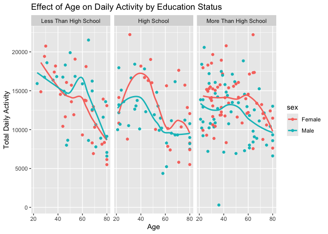
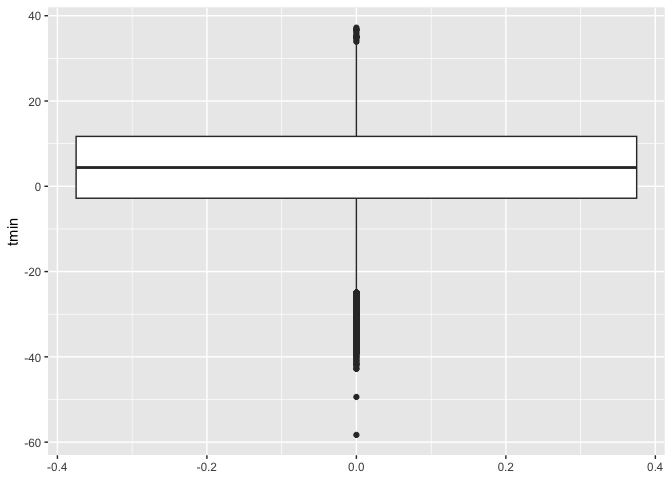
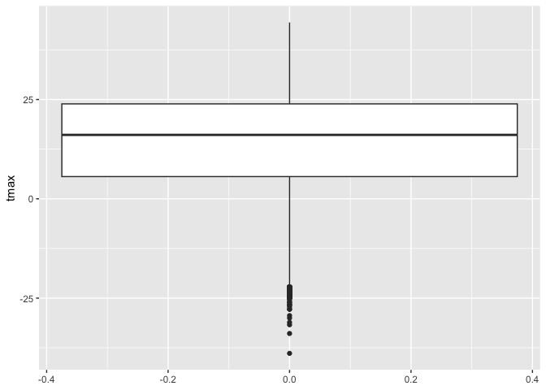

Homework 3
================
Kaleb J. Frierson
2024-10-12

- [Set-Up](#set-up)
- [Problem 1](#problem-1)
  - [Data Description](#data-description)
  - [Data Cleaning](#data-cleaning)
  - [Explortatory Analysis](#explortatory-analysis)
- [Problem 2](#problem-2)
- [Problem 3](#problem-3)

# Set-Up

Here I call libraries. This is updated throughout completion of the
homework such that there is not multiple spots in the project where
libraries are called.

``` r
library(tidyverse)
library(p8105.datasets)
library(patchwork)
```

# Problem 1

Below I bring in the ny_noaa data from the p8105.datasets package as
instructed.

``` r
data("ny_noaa")
```

## Data Description

Here I determine some basic structurual information using `nrow`,
`ncol`, and `colnames` functions to see row count, column count, and
variables names, respectively.

``` r
nrow(ny_noaa)
```

    ## [1] 2595176

``` r
ncol(ny_noaa)
```

    ## [1] 7

``` r
colnames(ny_noaa)
```

    ## [1] "id"   "date" "prcp" "snow" "snwd" "tmax" "tmin"

``` r
ny_noaa
```

    ## # A tibble: 2,595,176 × 7
    ##    id          date        prcp  snow  snwd tmax  tmin 
    ##    <chr>       <date>     <int> <int> <int> <chr> <chr>
    ##  1 US1NYAB0001 2007-11-01    NA    NA    NA <NA>  <NA> 
    ##  2 US1NYAB0001 2007-11-02    NA    NA    NA <NA>  <NA> 
    ##  3 US1NYAB0001 2007-11-03    NA    NA    NA <NA>  <NA> 
    ##  4 US1NYAB0001 2007-11-04    NA    NA    NA <NA>  <NA> 
    ##  5 US1NYAB0001 2007-11-05    NA    NA    NA <NA>  <NA> 
    ##  6 US1NYAB0001 2007-11-06    NA    NA    NA <NA>  <NA> 
    ##  7 US1NYAB0001 2007-11-07    NA    NA    NA <NA>  <NA> 
    ##  8 US1NYAB0001 2007-11-08    NA    NA    NA <NA>  <NA> 
    ##  9 US1NYAB0001 2007-11-09    NA    NA    NA <NA>  <NA> 
    ## 10 US1NYAB0001 2007-11-10    NA    NA    NA <NA>  <NA> 
    ## # ℹ 2,595,166 more rows

**There are 2595176 rows and 7 columns in this dataset. Each row appears
to be a different data collection point on a given “date” from a
location with a unique “id”. Measurements from these locations and times
(measured as date) include data for variables called: prcp, snow, snwd,
tmax, and tmin. I also view the first ten entries by running the dataset
name. Of note, tmin and tmax are being treated as character variables
when they should be numeric.**

Below I treat temperature as numeric.

``` r
hw_df =
  ny_noaa |> 
  mutate(
    tmax = as.numeric(na_if(na_if(tmax, ""), "NA")),  
    tmin = as.numeric(na_if(na_if(tmin, ""), "NA"))  
  )
```

Below I summarize the mean, min, and max of the maximum and minimum
temperatures. `na.rm = TRUE` removes missing values from calculations.

``` r
hw_df |> 
  summarize(
    tmax_mean = mean(tmax, na.rm = TRUE),
    tmax_min = min(tmax, na.rm = TRUE),
    tmax_max = max(tmax, na.rm = TRUE),
    tmin_mean = mean(tmin, na.rm = TRUE),
    tmin_min = min(tmin, na.rm = TRUE),
    tmin_max = max(tmin, na.rm = TRUE)
  )
```

    ## # A tibble: 1 × 6
    ##   tmax_mean tmax_min tmax_max tmin_mean tmin_min tmin_max
    ##       <dbl>    <dbl>    <dbl>     <dbl>    <dbl>    <dbl>
    ## 1      140.     -389      600      30.3     -594      600

**Something seems odd here with the values of tmin and max. Temperatures
of such extremes (high and low) seem a bit implausible. Especially in
NY. Clerical error? Lets look.**

Below I make a `geom_boxplot` to view the spread of the datapoints and
find any outliers.

``` r
hw_df |> 
  ggplot(aes(y=tmax)) +
  geom_boxplot()
```

    ## Warning: Removed 1134358 rows containing non-finite outside the scale range
    ## (`stat_boxplot()`).

<!-- -->
**Strange, extremes don’t seem to be outliers. I also find it hard to
believe the average maximum temperature is over 100 degrees (Fahrenheit
or Celsius). Looking at data description, temperature values are
reported in tenths of degrees celcius, NOT degrees. That is weird, will
convert that soon so numbers are more sensible. Lets first look at how
many missing values there are.**

Below I will use `summarize()` to view missing across all data
collection variables.

``` r
hw_df |> 
  summarize(
    prcp_missing = sum(is.na(prcp)),
    snow_missing = sum(is.na(snow)),
    snwd_missing = sum(is.na(snwd)),
    tmax_missing = sum(is.na(tmax)),
    tmin_missing = sum(is.na(tmin))
  )
```

    ## # A tibble: 1 × 5
    ##   prcp_missing snow_missing snwd_missing tmax_missing tmin_missing
    ##          <int>        <int>        <int>        <int>        <int>
    ## 1       145838       381221       591786      1134358      1134420

**There are over 2 million rows in this dataset. More than half of the
rows have missing data. I would say this is problematic.**

## Data Cleaning

Below I drop rows with missing values, create separate variables for
year, month, and day. I also convert temperature to degrees Celsius.

``` r
hw_df = 
  hw_df |> 
  drop_na() |> 
  mutate(
    year = year(date),
    month = month(date),
    day = day(date),
    tmax = tmax/10, 
    tmin = tmin/10
  )

hw_df
```

    ## # A tibble: 1,222,433 × 10
    ##    id          date        prcp  snow  snwd  tmax  tmin  year month   day
    ##    <chr>       <date>     <int> <int> <int> <dbl> <dbl> <dbl> <dbl> <int>
    ##  1 USC00300023 1981-01-03     0     0     0 -12.2 -20.6  1981     1     3
    ##  2 USC00300023 1981-01-05     0     0     0  -5.6 -17.8  1981     1     5
    ##  3 USC00300023 1981-01-12     0     0     0 -12.2 -30.6  1981     1    12
    ##  4 USC00300023 1981-01-13     0     0     0  -6.7 -28.9  1981     1    13
    ##  5 USC00300023 1981-01-15     0     0     0  -5   -10.6  1981     1    15
    ##  6 USC00300023 1981-01-17     0     0     0  -1.1 -15    1981     1    17
    ##  7 USC00300023 1981-01-20     0     0     0   6.1  -6.7  1981     1    20
    ##  8 USC00300023 1981-01-21     0     0     0   1.7 -10.6  1981     1    21
    ##  9 USC00300023 1981-01-22     0     0     0   0.6  -5    1981     1    22
    ## 10 USC00300023 1981-01-23   117   127    76   2.2  -4.4  1981     1    23
    ## # ℹ 1,222,423 more rows

Below I check to see how the values for tmax and tmin look now:

``` r
hw_df |> 
  ggplot(aes(y=tmax))+
  geom_boxplot() 
```

<!-- -->

``` r
hw_df|> 
  ggplot(aes(y=tmin))+
  geom_boxplot()
```

<!-- -->
**Looks a lot more sensible.**

What are the most common values for snowfall? Answering below using
`geom_histogram` generated in `ggplot`:

``` r
hw_df |>
  ggplot(aes(x=snwd))+
  geom_histogram()
```

    ## `stat_bin()` using `bins = 30`. Pick better value with `binwidth`.

<!-- -->
**The most common value for snowfall is 0mm. If you google average
annual days of snowfall in NYS, you will find that it varries across
city and at its highest is about 52 day (in Buffalo, thank you Lake
Erie). The data has over two decades of data during which period most of
the days per year do not have snowfall.**

## Explortatory Analysis

Make a facetted plot showing the average max temperature in January and
in July in each station across years. This is done below using `ggplot.`
I received additional formating guidance from
[r-graph-gallery.com](https://r-graph-gallery.com/223-faceting-with-ggplot2.html#:~:text=Faceting%20with%20facet_wrap()&text=It%20builds%20a%20new%20chart,charts%20on%20several%20rows%2Fcolumns.).

``` r
avg_temp =
  hw_df |>
  filter(month %in% c(1, 7)) |> 
  group_by(id, year, month) |> 
  summarize(avg_tmax = mean(tmax, na.rm = TRUE), .groups = 'drop')

ggplot(avg_temp, aes(x = year, y = avg_tmax, color = factor(month))) +
  geom_line() +
  facet_wrap(
    ~ month, scales = "free_y", 
    labeller = labeller(month = c(`1` = "January", `7` = "July"))) +
  labs(title = "Average Max Temperature in January and July by Station",
       x = "Year",
       y = "Average Max Temperature (°C)",
       color = "Month") +
  theme_minimal()
```

<!-- -->

**Average maximum temperature seems to be increasing over time. Average
minimum temperature doesn’t have as much of a positive association with
year as maximum does. There seems to be an outlier in ~ 1996 and 1982
for average max temp in January and ~ 1988 for average min temp in
July.**

Below I use `patchwork` and `gpplot` to make a two pannel figure. See
[P8105 Visualization
2](https://p8105.com/visualization_pt2.html#patchwork).

``` r
t_max_t_min = 
  hw_df |> 
  ggplot(aes(x = tmax, y = tmin)) +
  geom_hex() +
  labs(title = "tmax vs tmin",
       x = "Max Temperature (°C)",
       y = "Min Temperature (°C)") +
  theme_minimal()

snowflake = 
  hw_df |>
  filter(snow > 0 & snow < 100) |> 
  ggplot(aes(x = snow)) +
  geom_histogram(binwidth = 1, fill = "blue", color = "black") +
  facet_wrap(~ year) +
  labs(title = "Distribution of Snowfall Values (0 < snow < 100)",
       x = "Snowfall (inches)",
       y = "Frequency") +
  theme_minimal()

t_max_t_min + snowflake
```

<!-- -->

# Problem 2

Accelerometers have become an appealing alternative to self-report
techniques for studying physical activity in observational studies and
clinical trials, largely because of their relative objectivity. During
observation periods, the devices can measure MIMS in a short period;
one-minute intervals are common. Because accelerometers can be worn
comfortably and unobtrusively, they produce around-the-clock
observations.

This problem uses accelerometer data collected on 250 participants in
the NHANES study. The participants’ demographic data can be downloaded
here, and their accelerometer data can be downloaded here. Variables
\*MIMS are the MIMS values for each minute of a 24-hour day starting at
midnight.

Load, tidy, merge, and otherwise organize the data sets. Your final
dataset should include all originally observed variables; exclude
participants less than 21 years of age, and those with missing
demographic data; and encode data with reasonable variable classes
(i.e. not numeric, and using factors with the ordering of tables and
plots in mind).

Produce a reader-friendly table for the number of men and women in each
education category, and create a visualization of the age distributions
for men and women in each education category. Comment on these items.

Traditional analyses of accelerometer data focus on the total activity
over the day. Using your tidied dataset, aggregate across minutes to
create a total activity variable for each participant. Plot these total
activities (y-axis) against age (x-axis); your plot should compare men
to women and have separate panels for each education level. Include a
trend line or a smooth to illustrate differences. Comment on your plot.

Accelerometer data allows the inspection activity over the course of the
day. Make a three-panel plot that shows the 24-hour activity time
courses for each education level and use color to indicate sex. Describe
in words any patterns or conclusions you can make based on this graph;
including smooth trends may help identify differences.

# Problem 3

Citi Bike is a bike sharing system in New York City; riders can rent
pedal-powered or electric bikes from starting stations and return them
to another station at their destination. Introduced in 2013, the system
is immensely popular and expanded rapidly. Riders who use this system
often may become “members” with lower rental rates.

This zip file contains data on rides taken on the NYC Citi Bike system.
Files contain 1% of all rides with a total duration less than 4 hours in
each of four months. Import, clean, and tidy these data, and describe
the resulting dataset.

Produce a reader-friendly table showing the total number of rides in
each combination of year and month separating casual riders and Citi
Bike members. Comment on these results.

Make a table showing the 5 most popular starting stations for July 2024;
include the number of rides originating from these stations.

Make a plot to investigate the effects of day of the week, month, and
year on median ride duration. This plot can include one or more panels,
but should facilitate comparison across all variables of interest.
Comment on your observations from this plot.

There were relatively few electric Citi Bikes in 2020, but many more are
available now. For data in 2024, make a figure that shows the impact of
month, membership status, and bike type on the distribution of ride
duration. Comment on your results.
