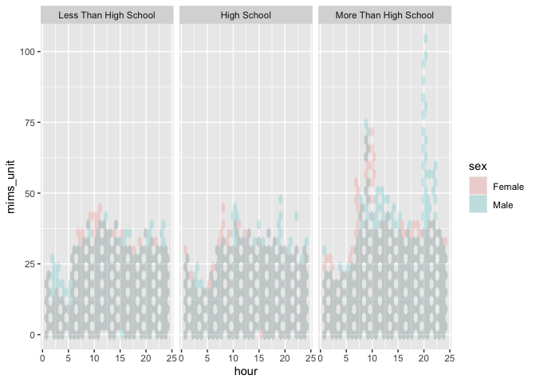
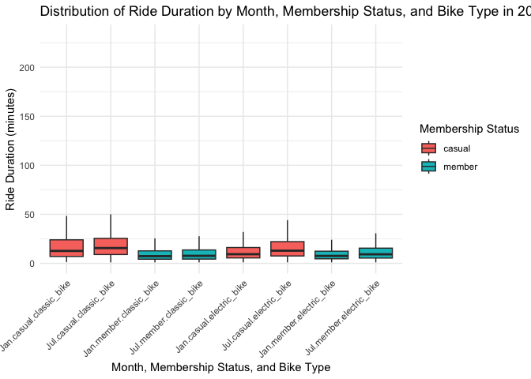

Homework 3
================
Kaleb J. Frierson
2024-10-12

- [Set-Up](#set-up)
- [Problem 1](#problem-1)
  - [Data Description](#data-description)
  - [Data Cleaning](#data-cleaning)
  - [Exploratory Analysis](#exploratory-analysis)
- [Problem 2](#problem-2)
  - [Data Wrangling](#data-wrangling)
  - [Tables & Plots](#tables--plots)
  - [Total Activity](#total-activity)
- [Problem 3](#problem-3)
  - [Data Wrangling](#data-wrangling-1)
  - [Tables](#tables)
  - [Plots](#plots)

# Set-Up

Here I call libraries. This is updated throughout completion of the
homework such that there is not multiple spots in the project where
libraries are called.

``` r
library(tidyverse)
library(p8105.datasets)
library(patchwork)
```

# Problem 1

Below I bring in the ny_noaa data from the p8105.datasets package as
instructed.

``` r
data("ny_noaa")
```

## Data Description

Here I determine some basic structurual information using `nrow`,
`ncol`, and `colnames` functions to see row count, column count, and
variables names, respectively.

``` r
nrow(ny_noaa)
```

    ## [1] 2595176

``` r
ncol(ny_noaa)
```

    ## [1] 7

``` r
colnames(ny_noaa)
```

    ## [1] "id"   "date" "prcp" "snow" "snwd" "tmax" "tmin"

``` r
ny_noaa
```

    ## # A tibble: 2,595,176 × 7
    ##    id          date        prcp  snow  snwd tmax  tmin 
    ##    <chr>       <date>     <int> <int> <int> <chr> <chr>
    ##  1 US1NYAB0001 2007-11-01    NA    NA    NA <NA>  <NA> 
    ##  2 US1NYAB0001 2007-11-02    NA    NA    NA <NA>  <NA> 
    ##  3 US1NYAB0001 2007-11-03    NA    NA    NA <NA>  <NA> 
    ##  4 US1NYAB0001 2007-11-04    NA    NA    NA <NA>  <NA> 
    ##  5 US1NYAB0001 2007-11-05    NA    NA    NA <NA>  <NA> 
    ##  6 US1NYAB0001 2007-11-06    NA    NA    NA <NA>  <NA> 
    ##  7 US1NYAB0001 2007-11-07    NA    NA    NA <NA>  <NA> 
    ##  8 US1NYAB0001 2007-11-08    NA    NA    NA <NA>  <NA> 
    ##  9 US1NYAB0001 2007-11-09    NA    NA    NA <NA>  <NA> 
    ## 10 US1NYAB0001 2007-11-10    NA    NA    NA <NA>  <NA> 
    ## # ℹ 2,595,166 more rows

**There are 2595176 rows and 7 columns in this dataset. Each row appears
to be a different data collection point on a given “date” from a
location with a unique “id”. Measurements from these locations and times
(measured as date) include data for variables called: prcp, snow, snwd,
tmax, and tmin. I also view the first ten entries by running the dataset
name. Of note, tmin and tmax are being treated as character variables
when they should be numeric.**

Below I treat temperature as numeric.

``` r
hw_df =
  ny_noaa |> 
  mutate(
    tmax = as.numeric(na_if(na_if(tmax, ""), "NA")),  
    tmin = as.numeric(na_if(na_if(tmin, ""), "NA"))  
  )
```

Below I summarize the mean, min, and max of the maximum and minimum
temperatures. `na.rm = TRUE` removes missing values from calculations.

``` r
hw_df |> 
  summarize(
    tmax_mean = mean(tmax, na.rm = TRUE),
    tmax_min = min(tmax, na.rm = TRUE),
    tmax_max = max(tmax, na.rm = TRUE),
    tmin_mean = mean(tmin, na.rm = TRUE),
    tmin_min = min(tmin, na.rm = TRUE),
    tmin_max = max(tmin, na.rm = TRUE)
  )
```

    ## # A tibble: 1 × 6
    ##   tmax_mean tmax_min tmax_max tmin_mean tmin_min tmin_max
    ##       <dbl>    <dbl>    <dbl>     <dbl>    <dbl>    <dbl>
    ## 1      140.     -389      600      30.3     -594      600

**Something seems odd here with the values of tmin and max. Temperatures
of such extremes (high and low) seem a bit implausible. Especially in
NY. Clerical error? Lets look.**

Below I make a `geom_boxplot` to view the spread of the datapoints and
find any outliers.

``` r
hw_df |> 
  ggplot(aes(y=tmax)) +
  geom_boxplot()
```

    ## Warning: Removed 1134358 rows containing non-finite outside the scale range
    ## (`stat_boxplot()`).

<!-- -->
**Strange, extremes don’t seem to be outliers. I also find it hard to
believe the average maximum temperature is over 100 degrees (Fahrenheit
or Celsius). Looking at data description, temperature values are
reported in tenths of degrees celcius, NOT degrees. That is weird, will
convert that soon so numbers are more sensible. Lets first look at how
many missing values there are.**

Below I will use `summarize()` to view missing across all data
collection variables.

``` r
hw_df |> 
  summarize(
    prcp_missing = sum(is.na(prcp)),
    snow_missing = sum(is.na(snow)),
    snwd_missing = sum(is.na(snwd)),
    tmax_missing = sum(is.na(tmax)),
    tmin_missing = sum(is.na(tmin))
  )
```

    ## # A tibble: 1 × 5
    ##   prcp_missing snow_missing snwd_missing tmax_missing tmin_missing
    ##          <int>        <int>        <int>        <int>        <int>
    ## 1       145838       381221       591786      1134358      1134420

**There are over 2 million rows in this dataset. More than half of the
rows have missing data. I would say this is problematic.**

## Data Cleaning

Below I drop rows with missing values, create separate variables for
year, month, and day. I also convert temperature to degrees Celsius.

``` r
hw_df = 
  hw_df |> 
  drop_na() |> 
  mutate(
    year = year(date),
    month = month(date),
    day = day(date),
    tmax = tmax/10, 
    tmin = tmin/10
  )

hw_df
```

    ## # A tibble: 1,222,433 × 10
    ##    id          date        prcp  snow  snwd  tmax  tmin  year month   day
    ##    <chr>       <date>     <int> <int> <int> <dbl> <dbl> <dbl> <dbl> <int>
    ##  1 USC00300023 1981-01-03     0     0     0 -12.2 -20.6  1981     1     3
    ##  2 USC00300023 1981-01-05     0     0     0  -5.6 -17.8  1981     1     5
    ##  3 USC00300023 1981-01-12     0     0     0 -12.2 -30.6  1981     1    12
    ##  4 USC00300023 1981-01-13     0     0     0  -6.7 -28.9  1981     1    13
    ##  5 USC00300023 1981-01-15     0     0     0  -5   -10.6  1981     1    15
    ##  6 USC00300023 1981-01-17     0     0     0  -1.1 -15    1981     1    17
    ##  7 USC00300023 1981-01-20     0     0     0   6.1  -6.7  1981     1    20
    ##  8 USC00300023 1981-01-21     0     0     0   1.7 -10.6  1981     1    21
    ##  9 USC00300023 1981-01-22     0     0     0   0.6  -5    1981     1    22
    ## 10 USC00300023 1981-01-23   117   127    76   2.2  -4.4  1981     1    23
    ## # ℹ 1,222,423 more rows

Below I check to see how the values for tmax and tmin look now:

``` r
hw_df |> 
  ggplot(aes(y=tmax))+
  geom_boxplot() 
```

<!-- -->

``` r
hw_df|> 
  ggplot(aes(y=tmin))+
  geom_boxplot()
```

<!-- -->

**Looks a lot more sensible.**

What are the most common values for snowfall? Answering below using
`geom_histogram` generated in `ggplot`:

``` r
hw_df |>
  ggplot(aes(x=snwd))+
  geom_histogram()
```

    ## `stat_bin()` using `bins = 30`. Pick better value with `binwidth`.

<!-- -->

**The most common value for snowfall is 0mm. If you google average
annual days of snowfall in NYS, you will find that it varries across
city and at its highest is about 52 day (in Buffalo, thank you Lake
Erie). The data has over two decades of data during which period most of
the days per year do not have snowfall.**

## Exploratory Analysis

Make a facetted plot showing the average max temperature in January and
in July in each station across years. This is done below using `ggplot.`
I received additional formating guidance from
[r-graph-gallery.com](https://r-graph-gallery.com/223-faceting-with-ggplot2.html#:~:text=Faceting%20with%20facet_wrap()&text=It%20builds%20a%20new%20chart,charts%20on%20several%20rows%2Fcolumns.).

``` r
avg_temp =
  hw_df |>
  filter(month %in% c(1, 7)) |> 
  group_by(id, year, month) |> 
  summarize(avg_tmax = mean(tmax, na.rm = TRUE), .groups = 'drop')

ggplot(avg_temp, aes(x = year, y = avg_tmax, color = factor(month))) +
  geom_line() +
  facet_wrap(
    ~ month, scales = "free_y", 
    labeller = labeller(month = c(`1` = "January", `7` = "July"))) +
  labs(title = "Average Max Temperature in January and July by Station",
       x = "Year",
       y = "Average Max Temperature (°C)",
       color = "Month") +
  theme_minimal()
```

<!-- -->

**Average maximum temperature seems to be increasing over time. Average
minimum temperature doesn’t have as much of a positive association with
year as maximum does. There seems to be an outlier in ~ 1996 and 1982
for average max temp in January and ~ 1988 for average min temp in
July.**

Below I use `patchwork` and `gpplot` to make a two pannel figure. See
[P8105 Visualization
2](https://p8105.com/visualization_pt2.html#patchwork).

``` r
t_max_t_min = 
  hw_df |> 
  ggplot(aes(x = tmax, y = tmin)) +
  geom_hex() +
  labs(title = "tmax vs tmin",
       x = "Max Temperature (°C)",
       y = "Min Temperature (°C)") +
  theme_minimal()

snowflake = 
  hw_df |>
  filter(snow > 0 & snow < 100) |> 
  ggplot(aes(x = snow)) +
  geom_histogram(binwidth = 1, fill = "blue", color = "black") +
  facet_wrap(~ year) +
  labs(title = "Distribution of Snowfall Values (0 < snow < 100)",
       x = "Snowfall (inches)",
       y = "Frequency") +
  theme_minimal()

t_max_t_min + snowflake
```

<!-- -->

# Problem 2

## Data Wrangling

Below I use `read_csv` to bring in both datasets. I set missing value
information and `col types = false` so that the information doesn’t auto
populate in the rednered github document. Then I merge them. There are
`250` observations in both datasets and the new dataset.

``` r
mims = 
  read_csv("data/mims.csv", na = c("NA", "", "."),
           show_col_types = FALSE)

dem = 
  read_csv("data/dem.csv", na = c("NA", "", "."),
           skip = 4,
           show_col_types = FALSE)

merged <- full_join(dem, mims, by = "SEQN")
```

Below I `drop_na()` so there are no rows with missing values and I
recode sex and education to character variables. Then I `pivot_longer()`
such that each row is no longer unique to 1 SEQN, but rather each row is
an entry per SEQN per minute. I `filter()` to exclude entries where age
is less than 21. I also `mutate()` such that minute values are numeric,
there is a variable for hour of the day, and a variable for average mims
unit per hour of the day.

``` r
longer = 
  merged |> 
  drop_na() |> 
  filter(age >= 21) |>
  mutate(
    sex = recode(sex, `1` = "Male", `2` = "Female")) |>
  mutate(
    education = recode(education, `1` = "Less Than High School", 
                       `2` = "High School", 
                       `3` = "More Than High School")
  ) |>
  mutate(education = 
           factor(education, levels = c("Less Than High School", 
                                        "High School", 
                                        "More Than High School"))
  ) |> 
  pivot_longer(
    cols = starts_with("min"),
    names_to = "minute",         
    values_to = "mims_unit"
  ) |> 
  mutate(
    minute = as.numeric(gsub("min", "", minute))
  ) |>
  mutate(
    hour = ceiling(minute / 60))|> 
  group_by(SEQN, hour)|> 
  mutate(
    hour = ceiling(minute / 60))|> 
  mutate(
    avg_hourly_mims_unit = mean(mims_unit)) |> 
  group_by(SEQN, hour)     
```

## Tables & Plots

Below I produce a table for the number of men and women in each
education category using `knitr`.

``` r
table=
  longer |> 
  group_by(education, sex) |> 
  summarize(count = n(), .groups = 'drop') |> 
  pivot_wider(
    names_from = sex, 
    values_from = count, 
    values_fill = list(count = 0))


knitr::kable(table, caption = "Count of Men and Women by Education")
```

| education             | Female |  Male |
|:----------------------|-------:|------:|
| Less Than High School |  40320 | 38880 |
| High School           |  33120 | 50400 |
| More Than High School |  84960 | 80640 |

Count of Men and Women by Education

Below I create a visualization of the age distributions for men and
women in each education category.

``` r
men =
longer |> 
  filter(sex == "Male") |> 
  ggplot(aes(x = age)) +
  geom_histogram(position = "identity", alpha = 0.3, bins = 15) +
  facet_wrap(~ education) +
  labs(x = "Age", 
       y = "Number of Men") +
  theme_minimal()

women =
longer |> 
  filter(sex == "Female") |> 
  ggplot(aes(x = age)) +
  geom_histogram(position = "identity", alpha = 0.3, bins = 15) +
  facet_wrap(~ education) +
  labs(x= "",
       y = "Number of Women") +
  theme_minimal()

combined_plot=
  women / men + 
  plot_layout(guides = "collect") + 
  plot_annotation(title = "Age Distributions by Sex and Education Category")

combined_plot
```

<!-- -->

**Among study participants, there are considerably more males with high
school education than female with high school education. About the same
across sexes for those with less than high school and for those with
more than high school (although one might say there are more women than
men if you think 85000 is appreciably different from 81000, I do not).**

## Total Activity

Below I aggregate across minutes to create a total activity variable for
each participant. Then I plot these total activities (y-axis) against
age (x-axis). I compare men to women and have separate panels for each
education level. I include a smooth to illustrate differences.

``` r
total_activity =
  longer |> 
  group_by(SEQN, age, sex, education) |> 
  summarize(total_activity = sum(mims_unit, na.rm = TRUE), 
            .groups = "drop")

total_activity |>  
  ggplot(aes(x= age, y= total_activity, color = sex))+
  geom_point()+ 
  geom_smooth(se = FALSE)+
  facet_wrap(~education)+
  labs(x ="Age", y= "Total Daily Activity", title = "Effect of Age on Daily Activity by Education Status")
```

    ## `geom_smooth()` using method = 'loess' and formula = 'y ~ x'

<!-- -->

**Across all levels of education, daily activity decreases with age. The
slope of the decease is much more noticeable across the life course with
those who have less than a high school education compared to other
groups. Among those who complete high school, there is a steep reduction
from age 40 to 60 with a plateau for the remainder of the life course.**

Below I make a three-panel hex plot that shows the hourly measures of
MIMS unit by education level and sex. The reason I chose a hex plot is
because it provides a visualization of when both sexes are in a space on
the graph or not.

``` r
longer |> 
  ggplot(aes(x=hour, y=mims_unit, fill = sex))+
  geom_hex(alpha=0.2) + 
  facet_wrap(~education) 
```

<!-- -->

**There seems to be more women than men active in the early morning
hours among those who have more than a high school education.
Additionally, in that same group, more men are active than women in the
later hours of the day. I do not notice significant differences among
other groups. Maybe slightly more men active after 8pm than women among
those with a high school education.**

# Problem 3

## Data Wrangling

Here I use `read_csv` to import all four csv files. I use `nrow` to keep
track of observations in each dataset and sum them to ensure that I have
the correct number when I merge them all.

``` r
jan20 = 
  read_csv("data/citibike/Jan 2020 Citi.csv", show_col_types = FALSE) |> 
  mutate(month = "Jan", year = 2020)
nrow(jan20)
```

    ## [1] 12420

``` r
jan24 = 
  read_csv("data/citibike/Jan 2024 Citi.csv", show_col_types = FALSE) |> 
  mutate(month = "Jan", year = 2024)
nrow(jan24)
```

    ## [1] 18861

``` r
jul20 = 
  read_csv("data/citibike/July 2020 Citi.csv", show_col_types = FALSE) |> 
  mutate(month = "Jul", year = 2020)
nrow(jul20)
```

    ## [1] 21048

``` r
jul24 = 
  read_csv("data/citibike/July 2024 Citi.csv", show_col_types = FALSE) |> 
  mutate(month = "Jul", year = 2024)
nrow(jul24)
```

    ## [1] 47156

``` r
12420+18861+21048+47156
```

    ## [1] 99485

Here I use `bind_rows` to merge all four datasets into “city” and
confirm correct number of observations using `nrow`.

``` r
citi = 
  bind_rows(jan20, jul20, jan24, jul24)
nrow(citi)
```

    ## [1] 99485

## Tables

Below I create a `citi_table` dataframe that groups the city dataset by
year, month, member status, assigns counts, makes a `year_month`
variable (because I had made them seperate variables), pivots wider to
make the table, and arranges them by the new variable.

``` r
citi_table =
  citi |>  
  group_by(year, month, member_casual) |>  
  summarize(count = n(), .groups = 'drop') |> 
  mutate(year_month = paste(month, year)) |>
  select(year_month, member_casual, count) |> 
  pivot_wider(
    names_from = member_casual,   
    values_from = count          
  ) |>
  arrange(year_month) 

citi_table
```

    ## # A tibble: 4 × 3
    ##   year_month casual member
    ##   <chr>       <int>  <int>
    ## 1 Jan 2020      984  11436
    ## 2 Jan 2024     2108  16753
    ## 3 Jul 2020     5637  15411
    ## 4 Jul 2024    10894  36262

Below I make a table showing the 5 most popular starting stations for
July 2024 and I include the number of rides originating from these
stations.

``` r
popular = 
  citi |>  
  filter(month == "Jul", year == 2024) |>
  group_by(start_station_name) |> 
  summarize(num_rides = n()) |>
  arrange(desc(num_rides)) |> 
  head(5)

popular
```

    ## # A tibble: 5 × 2
    ##   start_station_name       num_rides
    ##   <chr>                        <int>
    ## 1 Pier 61 at Chelsea Piers       163
    ## 2 University Pl & E 14 St        155
    ## 3 W 21 St & 6 Ave                152
    ## 4 West St & Chambers St          150
    ## 5 W 31 St & 7 Ave                146

## Plots

Below I make a plot to investigate the effects of day of the week,
month, and year on median ride duration. This plot includes panels
using`facet_wrap`. Help in formatting from
[r-graph-gallery.com](https://r-graph-gallery.com/223-faceting-with-ggplot2.html#:~:text=Faceting%20with%20facet_wrap()&text=It%20builds%20a%20new%20chart,charts%20on%20several%20rows%2Fcolumns.).

``` r
ride_summary = 
  citi |> 
  group_by(weekdays, month, year) |> 
  summarize(median_duration = median(duration, na.rm = TRUE)) |> 
  ungroup()
```

    ## `summarise()` has grouped output by 'weekdays', 'month'. You can override using
    ## the `.groups` argument.

``` r
ride_summary |>  
  ggplot(aes(x= weekdays, y = median_duration, color = as.factor(year))) +
  geom_line(size = 1.2, aes(group = interaction(year, month))) +
  facet_wrap(~month) +
  labs(
    title = "Median Ride Duration by Day of the Week, Month, and Year",
    x = "Day of the Week",
    y = "Median Ride Duration (minutes)",
    color = "Year"
  ) +
  theme_minimal() + 
  theme(axis.text.x = element_text(angle = 45, hjust = 1)) 
```

    ## Warning: Using `size` aesthetic for lines was deprecated in ggplot2 3.4.0.
    ## ℹ Please use `linewidth` instead.
    ## This warning is displayed once every 8 hours.
    ## Call `lifecycle::last_lifecycle_warnings()` to see where this warning was
    ## generated.

<!-- -->

**It seems that median ride duration is longer on the weekends. It was
longer overall in 2020, quite significantly so when comparing July of
2020 to July of 2024. July 2020 had much more ridership than July 2024.
The gap between 2024 and 2020 is much smaller in January. Maybe COVID
played a role in this, since many more people were at home in 2020 and
the only solace was getting outside. Additionally, people could have
been afraid of using public transportation with other patrons.**

Below I use data in 2024 to make a figure that shows the impact of
month, membership status, and bike type on the distribution of ride
duration. I chose to use boxplots across each different group.

``` r
citi_2024 = 
  citi |> 
  filter(year == 2024)

citi_2024 |> 
  ggplot(aes(
    x = interaction(month, member_casual, rideable_type), 
    y = duration)) +
  geom_boxplot(aes(fill = member_casual), outlier.colour = NA, 
               position = position_dodge(0.8)) +
  labs(
    title = "Distribution of Ride Duration by Month, Membership Status, and Bike Type in 2024",
    x = "Month, Membership Status, and Bike Type",
    y = "Ride Duration (minutes)",
    fill = "Membership Status"
  ) +
  theme_minimal() + 
  theme(axis.text.x = element_text(angle = 45, hjust = 1))
```

<!-- -->

**It seems like there isn’t too much of a difference in ride duration
across month in 2024, type of bike used in 2024, or member status. Maybe
even higher ridership among casual riders than members overall.**
